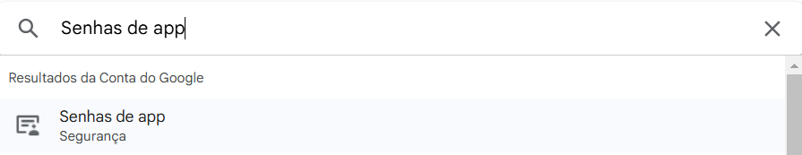

# Flask User Management System

Este projeto é uma aplicação simples de gerenciamento de usuários, construída com Flask e SQLAlchemy. Permite registrar novos usuários, fazer login, ativar e desativar usuários, além de editar informações de usuários existentes.

## Pré-requisitos

Antes de começar, você precisa ter instalado:

- [Python](https://www.python.org/downloads/) (3.6 ou superior)
- [pip](https://pip.pypa.io/en/stable/installation/) (gerenciador de pacotes do Python)
- [Flask](https://flask.palletsprojects.com/en/2.0.x/installation/#install-flask) e [Flask-SQLAlchemy](https://flask-sqlalchemy.palletsprojects.com/en/2.x/installation/)

## Instalação

1. Clone o repositório:

   ```bash
   git clone https://github.com/seu_usuario/seu_repositorio.git
   cd seu_repositorio
   ```

2. Crie um ambiente virtual (opcional, mas recomendado):

   ```bash
   python -m venv venv
   source venv/bin/activate  # Para Linux ou Mac
   venv\Scripts\activate  # Para Windows
   ```

3. Instale as dependências necessárias:

   ```bash
   pip install Flask Flask-SQLAlchemy
   pip install flask_mail
   pip install itsdangerous
   pip install Werkzeug
   ```

4. Crie o banco de dados:

   O banco de dados SQLite será criado automaticamente ao executar a aplicação pela primeira vez.

## Executando a Aplicação

1. Certifique-se de que está no diretório do projeto.

2. Execute a aplicação:

   ```bash
   python app.py
   ```

3. Acesse a aplicação no seu navegador em `http://127.0.0.1:5000/`.

## Funcionalidades

- **Página Inicial (`/`)**: Página de boas-vindas.
- **Login (`/login`)**: Permite que usuários registrados façam login.
- **Registro (`/register`)**: Permite registrar novos usuários.
- **Usuários (`/users`)**: Exibe uma lista de usuários cadastrados.
- **Ativar/Desativar Usuário**: Os usuários podem ser ativados ou desativados a partir da lista.
- **Edição de Usuário (`/editUser/<id>`)**: Permite editar as informações de um usuário específico.
- **Redefinir de Senha (`/reset_password/<token>`)**: Permite o usuário editar a senha caso tenha esquecido.

## Endpoints da API

- `POST /login`: Faz login de um usuário.
- `POST /register`: Registra um novo usuário.
- `GET /users`: Retorna uma lista de todos os usuários.
- `POST /usersDesactive/<id>`: Desativa um usuário.
- `POST /usersActive/<id>`: Ativa um usuário.
- `POST /editUser/<id>`: Edita um usuário específico.
- `POST/GET /forgot_password/`: Envia email para redefinição do senha
- `POST /reset_password/<token>'`: É acessado pelo link do e-mail com um token para redefinir a senha

## Estrutura do Banco de Dados

A aplicação utiliza um banco de dados SQLite com a seguinte tabela:

### User

- `id`: Identificador único do usuário.
- `login`: Nome de usuário (email).
- `senha`: Senha do usuário (armazenada como hash).
- `nome_real`: Nome completo do usuário.
- `data_criacao`: Data de criação do usuário.
- `status`: Status do usuário (ativo ou bloqueado).
- `data_atualizacao`: Data da última atualização do usuário.

## Contribuição

Contribuições são bem-vindas! Sinta-se à vontade para enviar um pull request.

## Licença

Este projeto é de domínio público. Sinta-se à vontade para usar e modificar como desejar.

## SMTP

Este projeto necessita de um e-mail e uma senha gerado via senha de apps no google developer

**Passo 1**
Acessar o navegador e pressionar no seu perfil no canto direito superior, lá você pressionara acessar gerir conta do google


**Passo 2**
Ao se deparar com esta tela voce ira pesquisar no campo de pesquisa por senhas de app selecionando o primeiro resultado


**Passo 3**
Nesta tela voce tera suas senhas e a disponibilidade de criar novas, preenchendo o campo do Nome do app, e colocando um nome a qual deseja,
após colocar o nome e pressionar em criar sera disponibilizado a senha e está, você ira inserir no projeto no arquivo `main.py` na linha 15
onde está escrito `app.config['MAIL_PASSWORD'] = 'sua key do email'` e na linha acima onde está escrito `app.config['MAIL_USERNAME'] = 'seuemail@gmail.com'` será necessário seu e-mail
